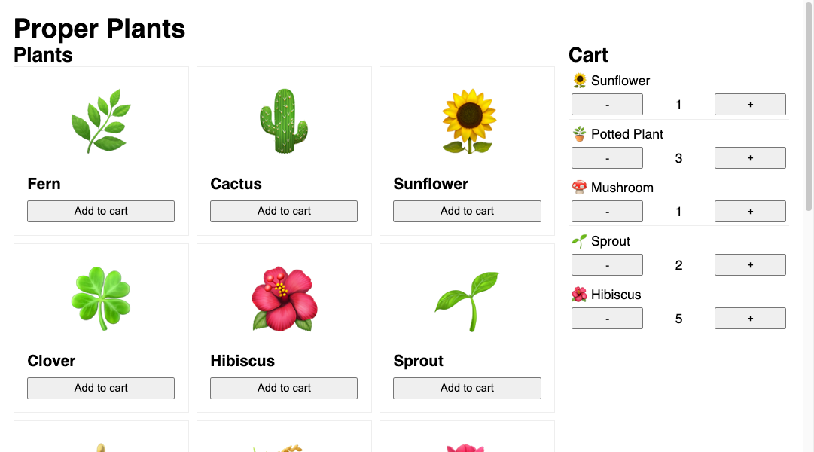

# Proper Plants

Welcome to Proper Plants, a thriving local nursery that offers a wide selection of plants
for your landscaping needs! In this workshop, you'll create a landing page for this
fictional store that showcases a grid of available plants. Users will be able to add
plants to their cart as well as change the quantity of something already in their cart, or
remove an item from the cart altogether.

A [live demo of the finished project](https://proper-plants.netlify.app/) is available for
you to reference.

## Requirements

You'll be building this project from scratch! You are highly encouraged to reference previous solutions.
Your submission should meet the following requirements.

### Project Architecture

1. Each component is defined in its own file. In the future, this won't always be
   necessary, but the intention here is to get practice with importing and exporting
   components.
2. Folders are used to organize related components and files.

### App

3. The cart is managed as a state variable in `<App>`.
4. Functions to add items to or remove items from the cart are defined in `<App>`.
   These functions should update the cart in state.
5. The cart array in state is updated by using array methods such as `map` and `filter`
   to avoid direct array mutation.

> [!WARNING]
>
> In React, arrays should be treated as immutable when you store them in state. When you
> want to update an array stored in state, you need to either make a copy of an existing
> one or create a new array. See [this documentation on updating arrays in state](https://react.dev/learn/updating-arrays-in-state)
> for more details on how to do so.

### Plants

A hard-coded array of plants has already been provided for you in `src/data.js`.

6. Users can see the image and name of every plant in that array of plants.
   - The image is just an emoji character!
7. Each plant has an "Add to cart" button.
   - If the plant is already in the cart, the button will increase its quantity by 1.
   - If the plant is not in the cart, the button will add it to the cart with a quantity of 1.
8. This code is organized into _at least_ two separate components.

### Cart

9. The cart renders a cart item for each plant the user has added.
10. Each cart item shows the image and name of the plant.
11. Each cart item shows the quantity of the plant.
12. Each cart item has two buttons. One button decrements the quantity,
    and the other increments it.
13. If the quantity of a cart item is ever 0 or below, that item is removed from the cart.
14. This code is organized into _at least_ two separate components.

## Submission

Please submit the link to your public GitHub repository.
